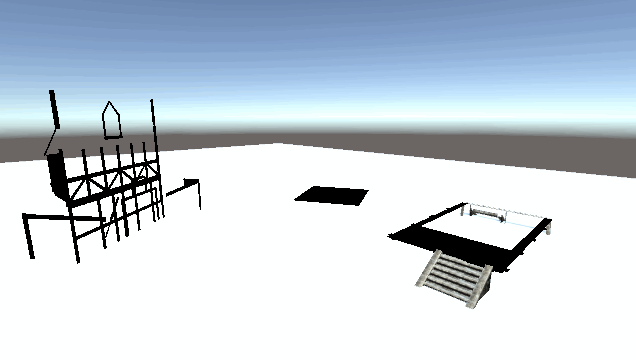

# Open Source Common Code for Unity 3D

This is a library of open source code that is useful across many projects. The code 
in this project is not intended to be standalone. It often does not provide a complete 
feature set. Instead this code is intended to be shared across many other code projects.

## BuildUp
A script that allows assets to be automatically "built" at runtime,
as would commonly be used in RTS, City Building or similar games. Just provide a few
steps in the build process and off it goes. Great for prototyping while you wait for the
real build artwork.

# Licensed for Reuse

All code here is under a license (Apache License V2) that means you can use them in any 
environment and without restriction. All you are required to do is provide a LICENSE 
and a NOTICE file in your project source.

# Contribution

We welcome contributions of new models and integrations of these models into other assets.

FIXME: Contribution guide
FIXME: Reference to Discord
